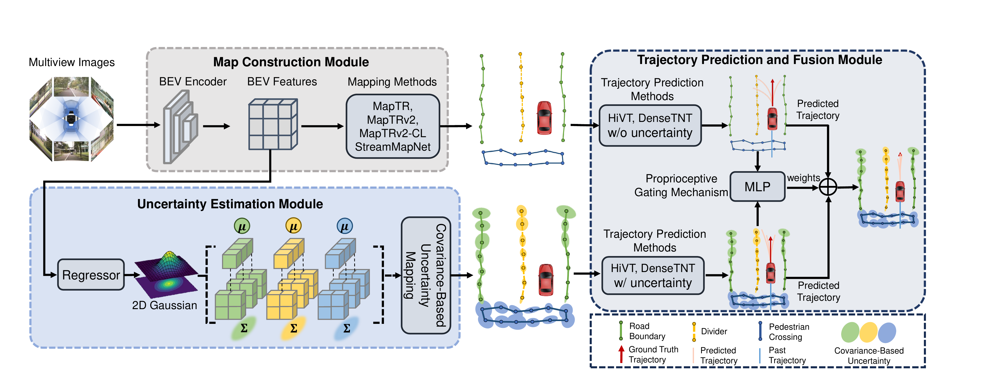
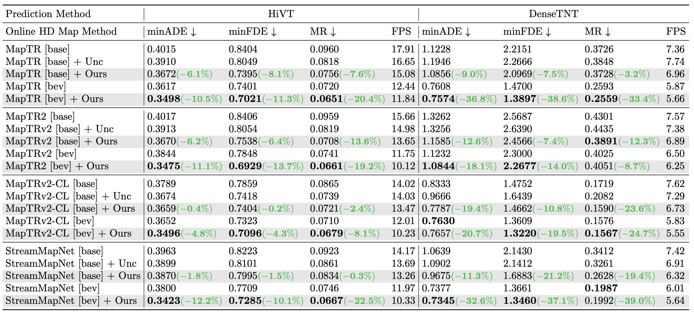
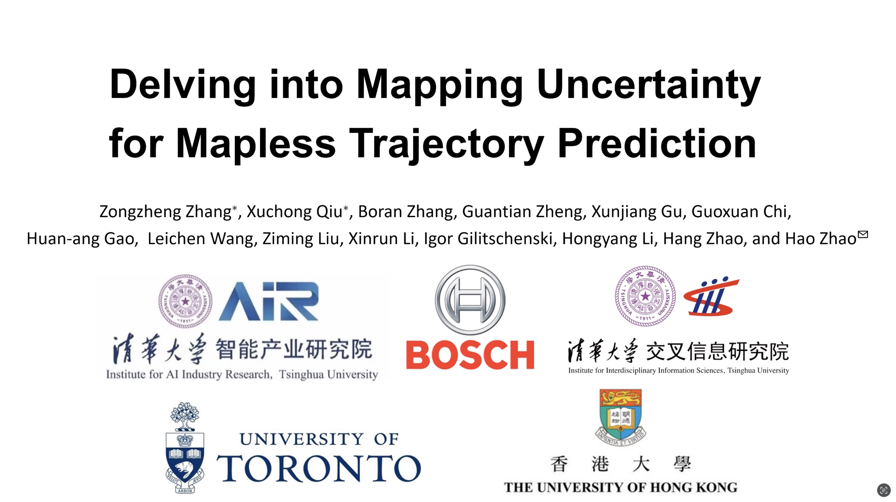

<div align="center">
<h2>Delving into Mapping Uncertainty for Mapless Trajectory Prediction</h2>

**Zongzheng Zhang**<sup>1,2*</sup> · **Xuchong Qiu**<sup>2*</sup> · **Boran Zhang**<sup>1</sup> · **Guantian Zheng**<sup>1</sup> · **Xunjiang Gu**<sup>4</sup> <br>
**Guoxuan Chi**<sup>1</sup> · **Huan-ang Gao**<sup>1</sup> · **Leichen Wang**<sup>2</sup> · **Ziming Liu**<sup>1</sup> · **Xinrun Li**<sup>2</sup> <br>
**Igor Gilitschenski**<sup>4</sup> · **Hongyang Li**<sup>5</sup> · [**Hang Zhao**](https://hangzhaomit.github.io/)<sup>3</sup> · [**Hao Zhao**](https://sites.google.com/view/fromandto/)<sup>1</sup>

<sup>1</sup> Institute for AI Industry Research (AIR), Tsinghua University · <sup>2</sup> Bosch Corporate Research <br>
<sup>3</sup> Institute for Interdisciplinary Information Sciences (IIIS), Tsinghua University <br>
<sup>4</sup> University of Toronto · <sup>5</sup> The University of Hong Kong <br>
<sub>(* indicates equal contribution)</sub>
</div>

This repository contains the implementation of our ongoing research on mapping uncertainty for mapless trajectory prediction, which we submitted to IROS 2025.
We propose a lightweight, self-supervised approach that enhances the synergy between online mapping and trajectory prediction, providing interpretability on when and where map uncertainty is beneficial. Additionally, we introduce a covariance-based uncertainty modeling method that better aligns with road geometry. Extensive ablation studies show that our method outperforms previous integration strategies, achieving up to 23.6% improvement in mapless trajectory prediction on the nuScenes dataset.

## Overview


We first estimate map elements online by encoding multi-view images into a common BEV feature space
to regress map element vertices. Each vertex’s uncertainty is modeled using our proposed Covariance-based Uncertainty method, which
leverages 2D Gaussian distribution templates. This uncertainty information, along with the original map vertices, is then passed to the
downstream trajectory prediction module, which operates in two parallel streams: one that incorporates uncertainty and one that does not.
Finally, the proposed Proprioceptive Scenario Gating (MLP network) dynamically adapts the optimal trajectory prediction based on the
initial future trajectories prediction from these two streams.

## Our results



## Our demo video

[](https://youtu.be/SbicP4tTv7I)

## Getting Started
- [Environment Setup](docs/env.md)
- [Prepare Dataset](docs/prepare_dataset.md)
- [Mapping Train and Eval](docs/map.md)
- [Merge Map and Trajectory Dataset](docs/adaptor.md)
- [Trajectory Train and Eval](docs/trj.md)
- [Visualization](docs/visualization.md)

## Checkpoints
Our trajectory prediction checkpoints are [here](https://drive.google.com/drive/folders/1npxVMMCyMgckBBXUnuRW8M3sYexpAObd?usp=sharing).

## Dataset

All the trajectory prediction data（for `MapTR`, `StreamMapNet`, `MapTRv2` and `MapTRv2 CL`）can be generated using our future checkpoints, with a total size of approximately 600GB.
Dataset Structure is as follows:
```
DelvingUncPrediction
├── trj_data/
│   ├── maptr/
│   |   ├── train/
│   |   |   ├── data/
│   |   |   |   ├── scene-{scene_id}.pkl
│   |   ├── val/
│   ├── maptrv2/
│   ├── maptrv2_CL/
│   ├── stream/
```

## Catalog

- [x] Code release
  - [x] MapTR
  - [x] MapTRv2
  - [x] StreamMapNet
  - [x] HiVT
  - [x] DenseTNT
- [x] Visualization Code
- [x] Untested version released + Instructions
- [x] Initialization


## License

This repository is licensed under [Apache 2.0](LICENSE).
