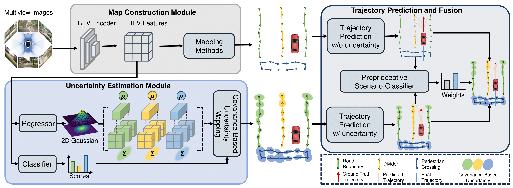

# Delving into Mapping Uncertainty for Mapless Trajectory Prediction
This repository contains the official implementation of [Delving into Mapping Uncertainty for Mapless Trajectory Prediction] published in IROS 2025. 



## Getting Started
- [Environment Setup](docs/env.md)
- [Prepare Dataset](docs/prepare_dataset.md)
- [Mapping Train and Eval](docs/map.md)
- [Merge Map and Trajectory Dataset](docs/adaptor.md)
- [Trajectory Train and Eval](docs/trj.md)
- [Visualization](docs/visualization.md)

## Results

Mapping checkpoints are [here](https://drive.google.com/drive/folders/1ZhCv4Z_yI7PLirHLS64luE1fV2EPG0sB?usp=sharing). Trajectory prediction checkpoints are [here](https://drive.google.com/drive/folders/1e0xRQqlIhYaAz3ErfNhZ57FCGN97vyzt?usp=sharing). 

## Dataset

All the trajectory prediction data（for `MapTR`, `StreamMapNet`, `MapTRv2` and `MapTRv2 CL`）can be generated using our future checkpoints, with a total size of approximately 600GB.
Dataset Structure is as follows:
```
DelvingUncPrediction
├── trj_data/
│   ├── maptr/
│   |   ├── train/
│   |   |   ├── data/
│   |   |   |   ├── scene-{scene_id}.pkl
│   |   ├── val/
│   ├── maptrv2/
│   ├── maptrv2_CL/
│   ├── stream/
```

## Catalog

- [x] Visualization Code
- [x] Code release
  - [x] MapTR
  - [x] MapTRv2
  - [x] StreamMapNet
  - [x] HiVT
  - [x] DenseTNT
- [x] Untested version released + Instructions
- [x] Initialization

## Citation

If you found this repository useful, please consider citing our work:

```
@Inproceedings{GuSongEtAl2024,
  author    = {Gu, Xunjiang and Song, Guanyu and Gilitschenski, Igor and Pavone, Marco and Ivanovic, Boris},
  title     = {Accelerating Online Mapping and Behavior Prediction via Direct BEV Feature Attention},
  booktitle = {European Conference on Computer Vision (ECCV)},
  year      = {2024}
}
```


## License

This repository is licensed under [Apache 2.0](LICENSE).
